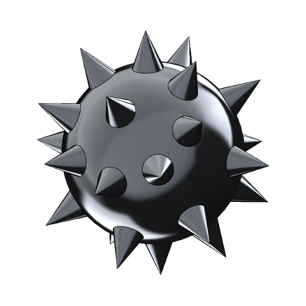
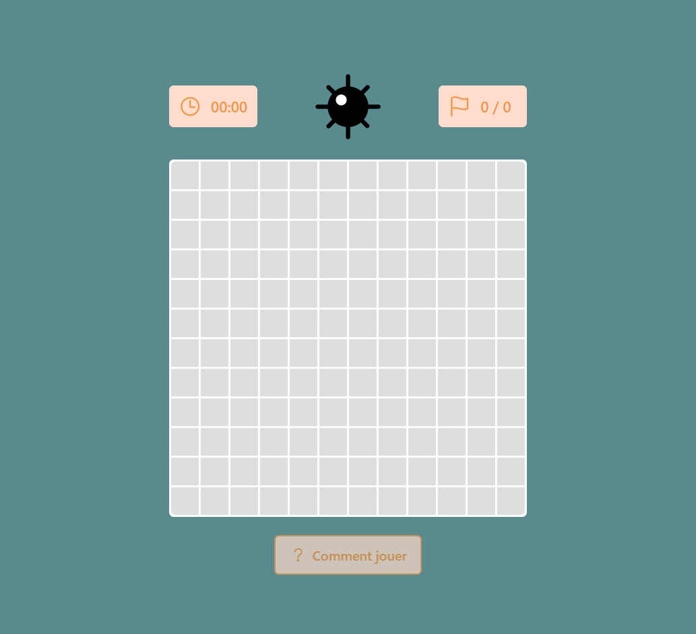
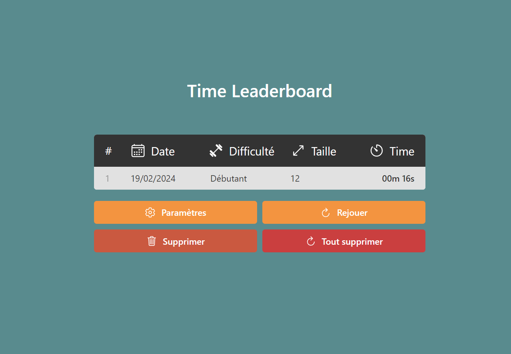

<div style="display: flex; align-items: center;gap: 20px;">
    
    <h1>Minesweeper</h1>
</div>

<p style="margin-top: 1em;">
Live Demo: <a href="https://minesweeper.alexisvasseur.fr">https://minesweeper.alexisvasseur.fr</a>
</p>

## 📌 Table of content

-   [Description](#description)
-   [Techno used](#techno-used)
-   [Installation](#installation)
    -   [Local](#local)
    -   [Docker](#docker)
-   [Credits](#credits)

## 📖 Description

Minesweeper is a game where the player has to clear a minefield without detonating any mine. The game is won when all the cells without a mine are revealed. The game is lost when a mine is revealed.

<div style="display: flex; align-items: flex-start; gap: 10px">
    
    
</div>

## ⚙️ Techno used

<ul style="columns: 2">
    <li>React</li>
    <li>Recoil</li>
    <li>TypeScript</li>
    <li>SCSS</li>
    <li>Docker</li>
</ul>

## ⬇️ Installation

### 💻 Local

-   Clone the repository

    ```bash
    git clone https://www.github.com/KeunotorCagoule/minesweeper.git
    ```

-   Install the dependencies

    ```bash
    npm install
    ```

-   Run the server as _development_

    ```bash
    npm start
    ```

-   Run the server as _production_

    ```bash
    npm run build
    npm i -g serve
    serve build
    ```

### 🐳 Docker

-   Build the image

    ```bash
    docker build -t minesweeper .
    ```

-   Run the container

    ```bash
    docker run --name minesweeper -dp 3000:3000 minesweeper
    ```

# 👩‍❤️‍👨 Credits

-   [KeunotorCagoule](https://www.github.com/KeunotorCagoule)
-   [UnEpicier](https://www.github.com/UnEpicier)
